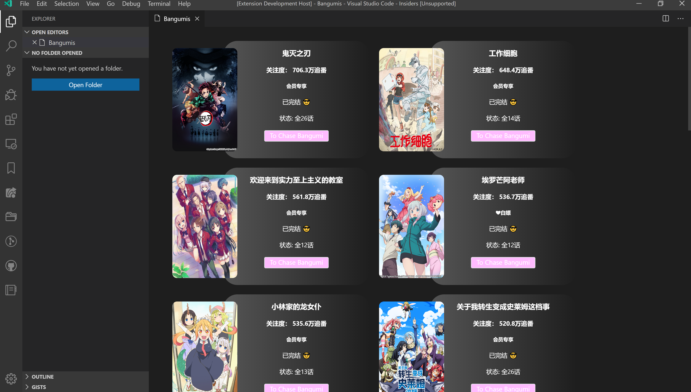

# Bangumi Open

一款基于 **Vscode** 的番剧插件.

## Description

使用 BILIBLI 的API.
目前只能提供简单的番剧查看.

## Usage

`Ctrl+Shift+P` 调出控制栏后,输入`Bangumi Open` 即可打开视图.

`Next Page` 和 `Back Page` 提供翻页功能.

## Future

可能会在将来提供的功能:

- 番剧索引
- 每周番剧推送
- <大嘘>在Vscode上看番???

**Enjoy!**
