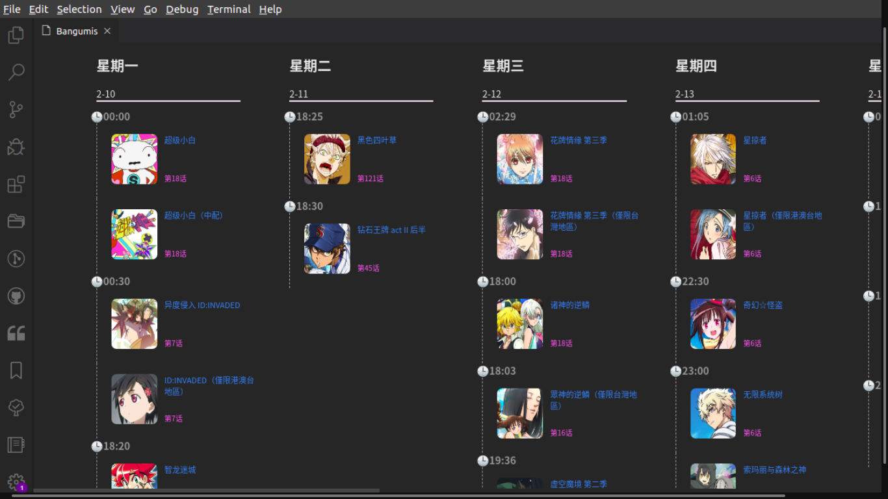

# Bangumi Open

[](https://travis-ci.com/sdttttt/vscode-bangumi)
[](https://dev.azure.com/shiinazch/Vscode%20Bangumi/_build/latest?definitionId=4&branchName=master)
[](https://www.codefactor.io/repository/github/sdttttt/vscode-bangumi/overview/master)

一款基于 **Vscode** 的番剧插件.




## Description

使用 BILIBLI 的 API.
提供的番剧浏览.

每周新番也可以.

## Functions in testing

**插件有自带提醒的功能.在番剧更新时会提醒你.**

该功能可以在配置文件中关闭.

## Configuration

```json
    //default Config

    // 是否显示前六天的番剧更新
    "BangumiOpen.DisplayHistory": false,
    // 是否开启番更新剧提醒
    "BangumiOpen.EnableReminder": true

```

## Usage

`Ctrl+Shift+P` 调出控制栏后,输入`Open Bangumi`或 `Bangumi Open: Week Bangumi` 即可打开视图.

`Next Page` 和 `Back Page` 提供翻页功能.

`Next Page` 可用 `Ctrl+alt+l` 代替

`Back Page` 可用 `Ctrl+alt+k` 代替

## Future

可能会在将来提供的功能:

- 番剧索引

## Contribution

|  contributer   | cover  |
|  ----  | ----  |
| sdttttt  |  |

<a target="_blank" href="http://mail.qq.com/cgi-bin/qm_share?t=qm_mailme&email=HW55aWlpaWlde3JlcHx0cTN_cnA" style="text-decoration:none;"></a>


# Enjoy!
